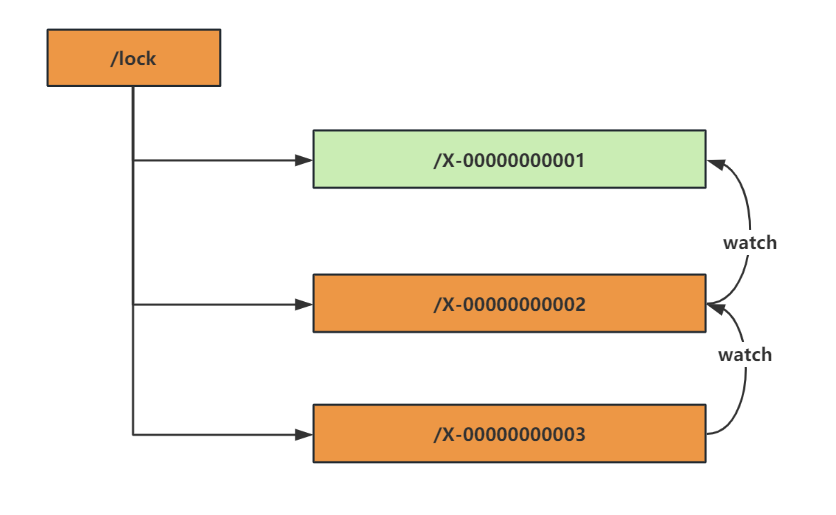

**高并发、微服务 、性能调优实战案例100讲，所有案例均源于个人工作实战，均配合代码落地**

加我微信：itsoku，所有案例均提供在线答疑。


# 第39节 分布式锁详解

<span style="font-weight:bold; color:red">目前整个课程59块钱，100个案例，含所有源码 & 文档 & 技术支持，可点击左下角小黄车了解</span>


# 本文主要内容

- 什么是分布式锁？
- 使用场景
- 分布式锁的一些特性
- 分布式锁需要考虑的一些问题
- 分布式锁常见的 3 种实现方案
- 分布式锁100%可靠么？

# 什么是分布式锁？

java中的synchronized、ReentrantLock大家都有用过吧，可以确保在单个jvm中，多线程访问共享资源安全性，当多个线程访问共享资源的时候，用 synchronized、ReentrantLock 将共享资源包裹起来，可确保共享资源只能被串行访问。

通常我们的系统都是集群部署的，一套代码会部署很多份，遇到这种情况，上面的解决方式就失效了，而分布式锁便可以解决这个问题。

如下图，3个客户端都想访问左边的共享资源，但是这个共线资源同一时间只允许一个客户端访问，那么这个地方就可以使用分布式锁，客户端需要先获取分布式锁，获取到锁之后才能访问共享资源。


# 使用场景

防止重复处理


# 分布式锁的需要具备的一些特性

## 互斥性

在任何时刻，只能有一个客户端持有锁，其他客户端不能同时持有该锁

## 安全性

在锁被释放之前，任何其他客户端都不能获得该锁。

## 可重入性

同一个线程获取锁之后，也可以再次获取这个锁.

## 支持尝试获取锁和等待获取锁

通常需要支持2种方式获取锁

1. 无等待时间的：不管能否获取到，都应该立即返回，比如ReentrantLock中的`public boolean tryLock()`，分布式也应该支持这种方式

2. 有超时等待时间的：可以指定一个超时时间，在这个时间内尝试获取锁，超过了这个时间还未获取到锁，也应该返回，比如下面这个方法

   ```java
   public boolean tryLock(long timeout, TimeUnit unit)
   ```

## 高效性

加锁和解锁需要高效


# 分布式锁需要考虑的一些问题

## 防止死锁

### 为什么会出现死锁？

使用者获取锁之后，锁还未被释放前，使用者突然挂掉了，此时其他使用者要能够获取到此锁。

### 这种情况如何解决？引入超时时间

引入超时时间，上锁时，给锁设置一个超时时间，超时时间到了之后，锁自动释放。

这里又会出现另外一个问题，锁的超时时间设置多长时间比较合适呢？

这个时间难以评估，比如超时时间设置了10秒，但是程序使用锁的时间可能会超过10秒，此时由于超时锁被释放了，导致其他使用者获取了锁，此时相当于多个使用者同时持有锁，会出现意想不到的问题，如何避免这个问题呢？可以引入锁自动续期功能

## 锁自动续期功能

锁的过期时间，不好评估，设置比较短的话会有提前过期的风险，设置的长，可能导致锁长时间得不到释放。

这种情况，我们可以引入自动续期的功能，可以开启一个线程，定时的去看下，使用锁的线程是否还活着，如果还在使用，则对锁进行续期，及延长锁的过期时间。

java中的Redisson就用到这个功能（watch dog），俗称看门狗。

> Redisson：使用java基于redis开发的一个非常好用的工具包，里面包含了很多好用的功能，比如本节讲的分布式锁

## 如何防止锁的误删？

### 什么是误删？

锁使用完成之后，会进行释放，释放通常就是把锁删掉，这里存在误删的可能性。

比如：A获取到分布式锁LOCK1之后，去执行业务，由于机器卡主了，导致锁超时了，此时B获取了分布式锁LOCK1，过了一会，A又恢复过来了，然后执行完业务之后，去释放锁，此时会把B持有的锁给释放掉。

### 如何避免误删？

A获取锁的时候，可以生成一个唯一标识，将这个唯一标识放在锁中，释放锁的时候，判断这个唯一标识和A手中的唯一标识是不是一致，若一致，则执行锁的释放操作，大致过程如下，不过这个过程一定要具有原子性，也就是说当有多个线程同时执行下面这个操作的时候，会排队执行，这种情况便可避免误删。

```java
if(判断锁是不是自己持有的){
	释放锁
}
```

> 可以参考Redisson 中释放锁的逻辑，他里面使用lua脚本实现的。
>
> 在Redis中，Lua脚本能够保证原子性的主要原因还是Redis采用了单线程执行模型。也就是说，当Redis执行Lua脚本时，Redis会把Lua脚本作为一个整体并把它当作一个任务加入到一个队列中，然后单线程按照队列的顺序依次执行这些任务，在执行过程中Lua脚本是不会被其他命令或请求打断，因此可以保证每个任务的执行都是原子性的。


# 分布式锁常见的实现方式（3种）

## 方式1：redis 实现分布式锁

### 使用Redisson

这块推荐大家使用Redisson，非常好用的一个java版本的redis工具包，里面已经帮我们实现了分布式锁。

### 加锁核心代码

采用lua脚本实现的，主要代码如下

> redis中命令的执行是单线程的，lua 脚本（下面一整段命令）也被当做一个命令执行，意味着同一时间只有一个命令在redis中运行，所以下面命令可以确保多客户端同时获取锁的情况下，只有一个可以成功获取锁。

```java
org.redisson.RedissonLock#tryLockInnerAsync

<T> RFuture<T> tryLockInnerAsync(long waitTime, long leaseTime, TimeUnit unit, long threadId, RedisStrictCommand<T> command) {
        return evalWriteAsync(getRawName(), LongCodec.INSTANCE, command,
                // 上锁成功的条件：锁不存在 || 锁是当前线程持有的
                "if ((redis.call('exists', KEYS[1]) == 0) " +   // 判断锁是否不存在？
                            "or (redis.call('hexists', KEYS[1], ARGV[2]) == 1)) then " + // 判断锁是否是自己持有的？hash结构
                        "redis.call('hincrby', KEYS[1], ARGV[2], 1); " + // 将锁的持有次数+1
                        "redis.call('pexpire', KEYS[1], ARGV[1]); " +  // 设置过期时间
                        "return nil; " + // 返回 null
                    "end; " +
                    "return redis.call('pttl', KEYS[1]);",  // 若未获取到锁，则返回锁的过期时间，获取则拿到这个时间可以知道自己应该等待多久
                Collections.singletonList(getRawName()), unit.toMillis(leaseTime), getLockName(threadId));
    }

```

### 释放锁的核心代码

采用lua脚本实现的，主要代码如下

```java
org.redisson.RedissonLock#unlockInnerAsync

protected RFuture<Boolean> unlockInnerAsync(long threadId) {
        return evalWriteAsync(getRawName(), LongCodec.INSTANCE, RedisCommands.EVAL_BOOLEAN,
              // 判断锁 key 是否存在
              "if (redis.call('hexists', KEYS[1], ARGV[3]) == 0) then " +
                        "return nil;" +
                    "end; " +
					// 将该客户端对应的锁的 hash 结构的 value 值递减为 0 后再进行删除
		            // 然后再向通道名为 redisson_lock__channel publish 一条 UNLOCK_MESSAGE 信息
                    "local counter = redis.call('hincrby', KEYS[1], ARGV[3], -1); " +
                    "if (counter > 0) then " +
                        "redis.call('pexpire', KEYS[1], ARGV[2]); " +
                        "return 0; " +
                    "else " +
                        "redis.call('del', KEYS[1]); " +
                        "redis.call('publish', KEYS[2], ARGV[1]); " +
                        "return 1; " +
                    "end; " +
                    "return nil;",
                Arrays.asList(getRawName(), getChannelName()), LockPubSub.UNLOCK_MESSAGE, internalLockLeaseTime, getLockName(threadId));
    }
```

> 主要干了2件事情
>
> 1. 删除锁（删除的过程件上面的描述，由于锁是可重入的，获取锁的次数为0的时候，才会将锁删除）
>
> 2. 广播一条消息，锁删除之后，会广播锁释放的消息，这样其他等待获取该锁的线程会被唤醒
>
>    > 这里说一下，如果一个线程没有获取到这个分布式锁，那么这个线程就会订阅这个分布式锁的释放事件，接着阻塞自己，如果锁释放的时候，就会广播事件，那么阻塞的线程就会被唤醒，被唤醒后会再次尝试去获得锁

## 方式2：zookeeper 实现分布式锁

zookeeper是使用临时顺序节点+watch机制实现的，下面我们简称zookeeper为zk。

这里面有3个关键知识点。

### 临时节点

当zk的客户端和zk断开连接的时候，临时节点会自动删除。

> zk客户端有2种下线方式
>
> - 主动的方式，客户端主动和zk断开连接
> - 被动的方式：zk客户端会按照指定的频率向zk发送心跳，超过某个时间zk未收到客户端的心跳，则zk认为客户端已断开连接了连接，此时临时节点会被删除

### 顺序节点

zk可以确保确保某个某个节点下创建的所有子节点的顺序性。

### watch机制

zk客户端可以去监听zk中的某个节点，当被监听的节点被删掉的时候，会给客户端的监听者发送通知。

### 加锁过程



1. 在/lock节点下创建一个临时顺序节点

2. 判断自己创建的节点是不是/lock下面编号最小的顺序节点
   - 是，则获取锁成功
   - 不是，则对前一个节点进行监听（watch）

### 释放锁的过程

将自己这个临时节点删掉。

zk会自动给监听这个节点的客户端发送通知，下一个节点会被唤醒，然后又会进入上面加锁的第2步。


## 方式3：数据库实现

可以看我之前写的这篇文章，使用唯一约束+乐观锁实现的

http://itsoku.com/course/3/60


## 如何选择？

- 性能上来说：redis版性能最高，zk随后，不过都需要引入中间件，对运维要求比较高
- 若不想引入第三方中间件，且对性能要求没有那么高，可以采用数据库实现


# 分布式锁100%靠谱么？

## 分布式锁并非100%靠谱

分布式锁99.99%的情况下，是靠谱的。

以redisson为例，当程序A获取到分布锁，cpu切换到其他程序了，此时程序A就像卡主了一样，A中的所有线程都卡主了，假如卡了1分钟后，恢复了，此时锁由于超时被释放了，会导致同一个锁被多个客户端获取。

zk也一样，zk客户端获取分布式锁以后，假如程序也卡主了，导致无法向zk发送心跳，zk以为客户端挂掉了，此时锁会被释放，也会导致同一个锁被多个客户端获取的可能性。

数据库版的分布式锁也存在这个问题，主要是锁存在超时时间，过了超时时间锁会被自动释放，但是程序可能并没有释放锁导致的。

Redisson中还有红锁，同样也会出现这个问题，只是可能性更小一些。

## 业务上做好兜底

虽然分布式锁理论上可能存在问题，但是这并不影响我们使用它，分布式锁性能高，我们将其作为第一道防线，程序本身自己还要去做兜底的工作。

比如幂等操作，分布式锁能帮忙拦一道，但是最终幂等业务方自己还需要兜底，比如使用数据库的唯一约束兜底，这个不可少。


# 高并发 & 微服务 & 性能调优实战案例100讲

## 已更新 39 节课

<span style="font-weight:bold; color:red">目前整个课程59块钱，含所有源码 & 文档 & 技术支持，一杯咖啡的价格，还没下手的朋友，赶紧了，马上要涨价了</span>。

```java
1. 分片上传实战
2. 通用并发处理工具类实战
3. 实现一个好用接口性能压测工具类
4. 超卖问题的4种解决方案，也是防止并发修改数据出错的通用方案
5. Semaphore实现接口限流实战
6. 并行查询，优化接口响应速度实战
7. 接口性能优化之大事务优化
8. 通用的Excel动态导出功能实战
9. 手写线程池管理器，管理&监控所有线程池
10. 动态线程池
11. SpringBoot实现动态Job实战
12. 并行查询，性能优化利器，可能有坑
13. 幂等的4种解决方案，吃透幂等性问题
14. 接口通用返回值设计与实现
15. 接口太多，各种dto、vo不计其数，如何命名？
16. 一个业务太复杂了，方法太多，如何传参？
17. 接口报错，如何快速定位日志？
18. 线程数据共享必学的3个工具类：ThreadLocal、InheritableThreadLocal、TransmittableThreadLocal
19. 通过AOP统一打印请求链路日志，排错效率飞升
20. 大批量任务处理常见的方案（模拟余额宝发放收益）
21. 并发环境下，如何验证代码是否正常？
22. MySql和Redis数据一致性
23. SpringBoot数据脱敏优雅设计与实现
24. 一行代码搞定系统操作日志
25. Aop简化MyBatis分页功能
26. ThreadLocal 遇到线程池有大坑 & 通用解决方案
27. SpringBoot读写分离实战（一个注解搞定读写分离 && 强制路由主库）
28. MQ专题-MQ典型的使用场景
29. MQ专题-如何确保消息的可靠性
30. MQ专题-SpringBoot中，手把手教你实现事务消息
31. 手写一个好用的延迟任务处理工具类
32. MQ专题-MQ延迟消息通用方案实战
33. MQ消息幂等消费 & 消费失败衰减式重试通用方案 & 代码 & 文档
34. MQ专题：顺序消息通用方案实战 & 代码落地 & 文档
35. MQ专题：消息积压相关问题及解决思路
36. 分布式事务-MQ最终一致性-实现跨库转账（案例+源码+文档）
37. 分布式事务-MQ最终一致性-实现电商账户余额提现到微信钱包（案例+源码+文档）
38. 分布式事务：通用的TCC分布式事务生产级代码落地实战
39. 分布式锁详解
```


## 课程部分大纲，连载中。。。。

以下课程均来源于个人多年的实战，均提供原理讲解 && 源码落地

1. 分片上传实战
2. 通用并发处理工具类实战
3. 实现一个好用接口性能压测工具类
4. 超卖问题的4种解决方案，也是防止并发修改数据出错的通用方案
5. Semaphore实现接口限流实战
6. 并行查询，优化接口响应速度实战
7. 接口性能优化之大事务优化
8. 通用的Excel动态导出功能实战
9. 手写线程池管理器，管理&监控所有线程池
10. 动态线程池
11. SpringBoot实现动态Job实战
12. 并行查询，性能优化利器，可能有坑
13. 幂等的4种解决方案，吃透幂等性问题
14. 接口通用返回值设计与实现
15. 接口太多，各种dto、vo不计其数，如何命名？
16. 一个业务太复杂了，方法太多，如何传参？
17. 接口报错，如何快速定位日志？
18. 线程数据共享必学的3个工具类：ThreadLocal、InheritableThreadLocal、TransmittableThreadLocal
19. 通过AOP统一打印请求链路日志，排错效率飞升
20. 大批量任务处理常见的方案（模拟余额宝发放收益）
21. 并发环境下，如何验证代码是否正常？
22. MySql和Redis数据一致性
23. SpringBoot数据脱敏优雅设计与实现
24. 一行代码搞定系统操作日志
25. Aop简化MyBatis分页功能
26. ThreadLocal 遇到线程池有大坑 & 通用解决方案
27. SpringBoot读写分离实战（一个注解搞定读写分离 && 强制路由主库）
28. MQ专题：MQ典型的7种使用场景
29. MQ专题：如何确保消息的可靠性
30. MQ专题：SpringBoot中，手把手教你实现事务消息
31. 手写一个好用的延迟任务处理工具类
32. MQ专题：延迟消息通用方案实战
33. MQ专题：消息幂等消费 & 消费失败自动重试通用方案 & 代码落地
34. MQ专题：顺序消息通用方案实战
35. MQ专题：消息积压问题
36. 分布式事务-MQ最终一致性-实现跨库转账（案例+源码+文档）
37. 分布式事务-MQ最终一致性-实现电商账户余额提现到微信钱包（案例+源码+文档）
38. 分布式事务：通用的TCC分布式事务生产级代码落地实战
39. 分布式锁
40. 分布式锁：提供一个好用的分布式锁工具类
41. 分布式锁：一个注解优雅实战分布式锁
42. 微服务中如何传递上下文？实战
43. 微服务链路日志追踪实战（原理&代码落地）
44. SpringBoot实现租户数据隔离
45. MyBatis进阶：封装MyBatis，实现通用的无SQL版CRUD功能，架构师必备
46. MyBatis进阶：自己实现通用分表功能，架构师必备
47. MyBatis进阶：实现多租户隔离ORM框架
48. SpringBoot中实现自动监听PO的变化，自动生成表结构
49. 分布式专题：其他实战课程等
50. 性能调优：如何排查死锁？
51. 性能调优：如何排查内存溢出？
52. 性能调优：CPU被打满，如何排查？
53. 性能调优：生产代码没生效，如何定位？
54. 性能调优：接口太慢，如何定位？
55. 性能调优：如何查看生产上接口的入参和返回值？
56. 性能调优：远程debug
57. 生产上出现了各种故障，如何定位？
58. db和缓存一致性，常见的方案
59. Redis场景案例。。。
60. 系统资金账户设计案例（一些系统涉及到资金操作）
61. 其他等各种实战案例。。。


