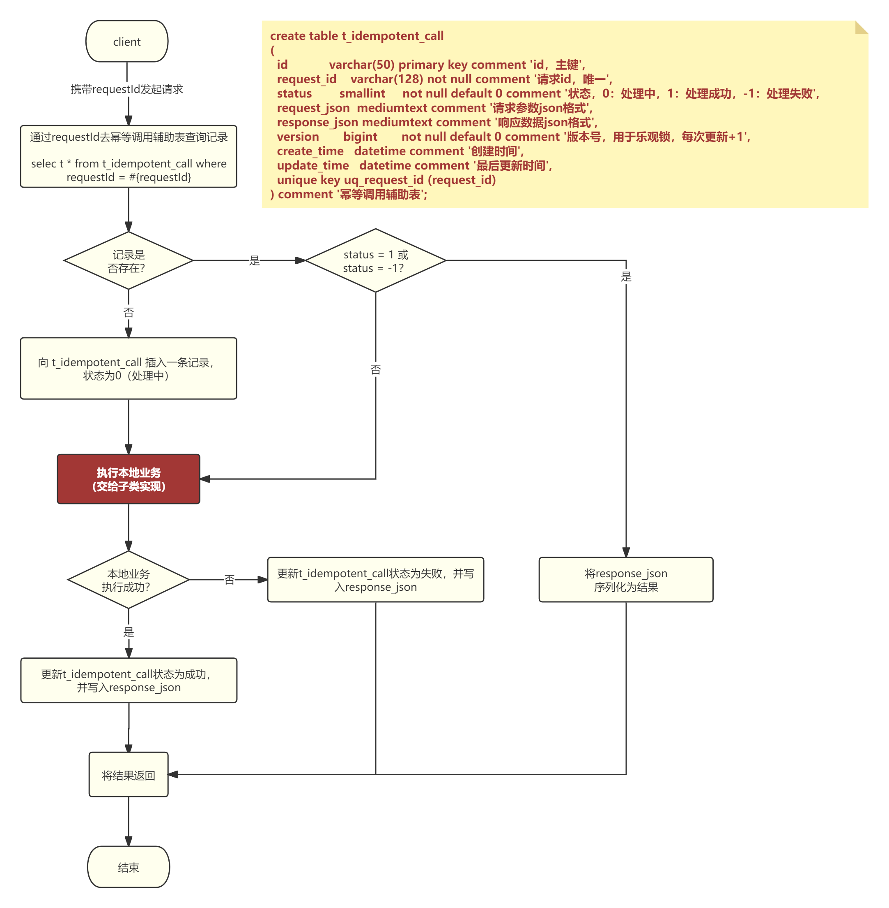

**高并发、微服务 、性能调优实战案例100讲，所有案例均源于个人工作实战，均配合代码落地**

加我微信：itsoku，所有案例均提供在线答疑。


# 第43节 接口幂等，通用方案 & 代码落地

<span style="font-weight:bold; color:red">目前整个课程59块钱，100个案例，含所有源码 & 文档 & 技术支持，可点击左下角小黄车了解</span>


## 1、本文内容

接口幂等，通用方案 & 代码落地，干货满满。


## 2、什么是幂等

幂等指多次操作产生的影响只会跟一次执行的结果相同，通俗的说：某个行为重复的执行，最终获取的结果是相同的。


## 3、接口幂等是什么？

同一个接口，对于同一个请求，不管调用多少次，产生的最终结果都应该是一样的。

举个例子，比如账户A给账户B转账100元，最终要么成功要么失败

- 对于成功的情况，这个请求不管再请求多少次，最终的结果：A给B只成功转入了100元，不会出现重复处理的情况
- 对于失败的情况，这个请求不管再请求多少次，转账都是失败

即成功或者失败后，不管如何重试，结果都不会再发生变化，这点大家一定要理解。


## 4、接口幂等需要考虑的点

### （1）如何确定是同一个请求？

可以在请求参数中添加一个通用的参数requestId，多个请求requestId相同的，则表示他们是相同的请求。

### （2）接口的执行结果只有3种情况

对于幂等性的接口，执行结果可以抽象为下面3种情况

- 0：处理中
- 1：处理成功
- -1：处理失败

返回给调用方的结果，只能是其中一种状态。

但是最终，接口的状态只能是成功或者失败，比如刚开始状态可能返回的是0（处理中），经过调用方多次重试以后，状态必须为终态（成功或失败）


## 5、接口幂等通用方案如何实现？

如下，咱们可以借助一张幂等辅助表，如下，通过这张表便可实现接口幂等通用方案

- 幂等接口对于同一个requestId，此表都会产生一条记录
- 此表会记录幂等接口调用的详细信息：请求id、请求的状态、请求参数json字符串、响应结果json格式字符串
- 记录的最终状态，一定会1或者-1，对于状态为0的，经过调用方的不断重试，status会变为1或者-1
- 当status为1或者-1后，response_json即为接口最终返回值

```sql
create table t_idempotent_call
(
    id            varchar(50) primary key comment 'id，主键',
    request_id    varchar(128) not null comment '请求id，唯一',
    status        smallint     not null default 0 comment '状态，0：处理中，1：处理成功，-1：处理失败',
    request_json  mediumtext comment '请求参数json格式',
    response_json mediumtext comment '响应数据json格式',
    version       bigint       not null default 0 comment '版本号，用于乐观锁，每次更新+1',
    create_time   datetime comment '创建时间',
    update_time   datetime comment '最后更新时间',
    unique key uq_request_id (request_id)
) comment '幂等调用辅助表';
```

下面来看下，通过张表如何实现接口幂等的通用方案


## 6、接口幂等处理通用流程



## 7、代码落地

### IdempotentCall：幂等调用顶层接口

需要实现幂等业务，需要实现该接口

### DefaultIdempotentCall：IdempotentCall接口默认实现

核心代码，上面流程图中除了红色的代码，其他的部分都在这个类中实现了。


## 8、案例

### 需求

提供一个转账接口，此接口需要支持幂等。

### 准备测试数据

```sql
-- 创建账户表
drop table if exists t_account_lesson043;
create table t_account_lesson043
(
    id      varchar(32)    not null primary key comment '用户id',
    name    varchar(50)    not null comment '用户名',
    balance decimal(12, 2) not null comment '账户余额'
) comment '账户表';

insert ignore into t_account_lesson043 value ('1','路人1','100.00');
insert ignore into t_account_lesson043 value ('2','路人2','0.00');
```

### 源码

```java
com.itsoku.lesson043.controller.AccountController#transfer
```

### 场景测试1：模拟正常转账

测试代码如下，从账号1中给账号2转10元，请求id为100000001，我们执行两次，观察执行结果，以及db中数据的变化。

```http
src/test/resources/AccountController.http

### 正常转账
POST http://localhost:8080/account/transfer
Content-Type: application/json
Accept: application/json

{
  "requestId": "100000001",
  "data": {
    "fromAccountId": "1",
    "toAccountId": "2",
    "transferPrice": "10.00"
  }
}
```

### 场景测试2：模拟失败的情况

测试代码如下，从账号1中给账号2转200元，请求id为100000002，账户1由于余额不足，下面的执行会失败

```http
src/test/resources/AccountController.http

### 转账失败，余额不足
POST http://localhost:8080/account/transfer
Content-Type: application/json
Accept: application/json

{
  "requestId": "100000002",
  "data": {
    "fromAccountId": "1",
    "toAccountId": "2",
    "transferPrice": "200.00"
  }
}
```

执行输出

```java
{
  "success": true,
  "data": {
    "status": -1,
    "code": null,
    "message": "付款方余额不足",
    "data": null
  },
  "msg": null,
  "code": null
}
```

我们把上面请求金额改为1元，按说余额是够的，然后再次执行看看

执行结果还是和第一次是一样的，因为结果已经保存到t_idempotent_call表了，对于同一个requestId，当t_idempotent_call表中的记录状态为1或者-1后，那么本次调用的结果就不会再发生变化了，这样完全符合接口幂等性要求。


## 9、如何使用？

参考上面的转账案例，主要步骤

1. 自定义一个类，继承`DefaultIdempotentCall`
2. 实现 disposeLocalBus 方法，在里面写对应的业务代码


## 10、源码获取

源码在lesson043这个模块中，需要的小伙伴可以加我微信：itsoku，获取。


# 高并发 & 微服务 & 性能调优实战案例100讲

## 已更新 43 节课

<span style="font-weight:bold; color:red">目前整个课程59块钱，含所有源码 & 文档 & 技术支持，一杯咖啡的价格，还没下手的朋友，赶紧了，马上要涨价了</span>。

```java
1. 分片上传实战
2. 通用并发处理工具类实战
3. 实现一个好用接口性能压测工具类
4. 超卖问题的4种解决方案，也是防止并发修改数据出错的通用方案
5. Semaphore实现接口限流实战
6. 并行查询，优化接口响应速度实战
7. 接口性能优化之大事务优化
8. 通用的Excel动态导出功能实战
9. 手写线程池管理器，管理&监控所有线程池
10. 动态线程池
11. SpringBoot实现动态Job实战
12. 并行查询，性能优化利器，可能有坑
13. 幂等的4种解决方案，吃透幂等性问题
14. 接口通用返回值设计与实现
15. 接口太多，各种dto、vo不计其数，如何命名？
16. 一个业务太复杂了，方法太多，如何传参？
17. 接口报错，如何快速定位日志？
18. 线程数据共享必学的3个工具类：ThreadLocal、InheritableThreadLocal、TransmittableThreadLocal
19. 通过AOP统一打印请求链路日志，排错效率飞升
20. 大批量任务处理常见的方案（模拟余额宝发放收益）
21. 并发环境下，如何验证代码是否正常？
22. MySql和Redis数据一致性
23. SpringBoot数据脱敏优雅设计与实现
24. 一行代码搞定系统操作日志
25. Aop简化MyBatis分页功能
26. ThreadLocal 遇到线程池有大坑 & 通用解决方案
27. SpringBoot读写分离实战（一个注解搞定读写分离 && 强制路由主库）
28. MQ专题-MQ典型的使用场景
29. MQ专题-如何确保消息的可靠性
30. MQ专题-SpringBoot中，手把手教你实现事务消息
31. 手写一个好用的延迟任务处理工具类
32. MQ专题-MQ延迟消息通用方案实战
33. MQ消息幂等消费 & 消费失败衰减式重试通用方案 & 代码 & 文档
34. MQ专题：顺序消息通用方案实战 & 代码落地 & 文档
35. MQ专题：消息积压相关问题及解决思路
36. 分布式事务-MQ最终一致性-实现跨库转账（案例+源码+文档）
37. 分布式事务-MQ最终一致性-实现电商账户余额提现到微信钱包（案例+源码+文档）
38. 分布式事务：通用的TCC分布式事务生产级代码落地实战
39. 分布式锁详解
40. 分享一个特别好用的Redissson分布式锁工具类
41. 一个注解轻松搞定分布式锁
42. 微服务中如何传递公共参数？
43. 接口幂等，通用方案 & 代码落地
```


## 课程部分大纲，连载中。。。。

以下课程均来源于个人多年的实战，均提供原理讲解 && 源码落地

1. 分片上传实战
2. 通用并发处理工具类实战
3. 实现一个好用接口性能压测工具类
4. 超卖问题的4种解决方案，也是防止并发修改数据出错的通用方案
5. Semaphore实现接口限流实战
6. 并行查询，优化接口响应速度实战
7. 接口性能优化之大事务优化
8. 通用的Excel动态导出功能实战
9. 手写线程池管理器，管理&监控所有线程池
10. 动态线程池
11. SpringBoot实现动态Job实战
12. 并行查询，性能优化利器，可能有坑
13. 幂等的4种解决方案，吃透幂等性问题
14. 接口通用返回值设计与实现
15. 接口太多，各种dto、vo不计其数，如何命名？
16. 一个业务太复杂了，方法太多，如何传参？
17. 接口报错，如何快速定位日志？
18. 线程数据共享必学的3个工具类：ThreadLocal、InheritableThreadLocal、TransmittableThreadLocal
19. 通过AOP统一打印请求链路日志，排错效率飞升
20. 大批量任务处理常见的方案（模拟余额宝发放收益）
21. 并发环境下，如何验证代码是否正常？
22. MySql和Redis数据一致性
23. SpringBoot数据脱敏优雅设计与实现
24. 一行代码搞定系统操作日志
25. Aop简化MyBatis分页功能
26. ThreadLocal 遇到线程池有大坑 & 通用解决方案
27. SpringBoot读写分离实战（一个注解搞定读写分离 && 强制路由主库）
28. MQ专题：MQ典型的7种使用场景
29. MQ专题：如何确保消息的可靠性
30. MQ专题：SpringBoot中，手把手教你实现事务消息
31. 手写一个好用的延迟任务处理工具类
32. MQ专题：延迟消息通用方案实战
33. MQ专题：消息幂等消费 & 消费失败自动重试通用方案 & 代码落地
34. MQ专题：顺序消息通用方案实战
35. MQ专题：消息积压问题
36. 分布式事务-MQ最终一致性-实现跨库转账（案例+源码+文档）
37. 分布式事务-MQ最终一致性-实现电商账户余额提现到微信钱包（案例+源码+文档）
38. 分布式事务：通用的TCC分布式事务生产级代码落地实战
39. 分布式锁
40. 分享一个特别好用的Redissson分布式锁工具类
41. 分布式锁：一个注解轻松实现布式锁
42. 微服务中如何传递上下文？实战
43. 接口幂等，通用方案 & 代码落地
44. SpringBoot链路追踪实战
46. MyBatis进阶：封装MyBatis，实现通用的无SQL版CRUD功能，架构师必备
47. MyBatis进阶：自己实现通用分表功能，架构师必备
48. MyBatis进阶：实现多租户隔离ORM框架
49. SpringBoot中实现自动监听PO的变化，自动生成表结构
50. SpringBoot优雅停机
51. 分布式专题：其他实战课程等
52. 性能调优：如何排查死锁？
53. 性能调优：如何排查内存溢出？
54. 性能调优：CPU被打满，如何排查？
55. 性能调优：生产代码没生效，如何定位？
56. 性能调优：接口太慢，如何定位？
57. 性能调优：如何查看生产上接口的入参和返回值？
58. 性能调优：远程debug
59. 生产上出现了各种故障，如何定位？
60. db和缓存一致性，常见的方案
61. Redis场景案例。。。
62. 系统资金账户设计案例（一些系统涉及到资金操作）
63. 工作中常见的场景案例设计与实现。。。