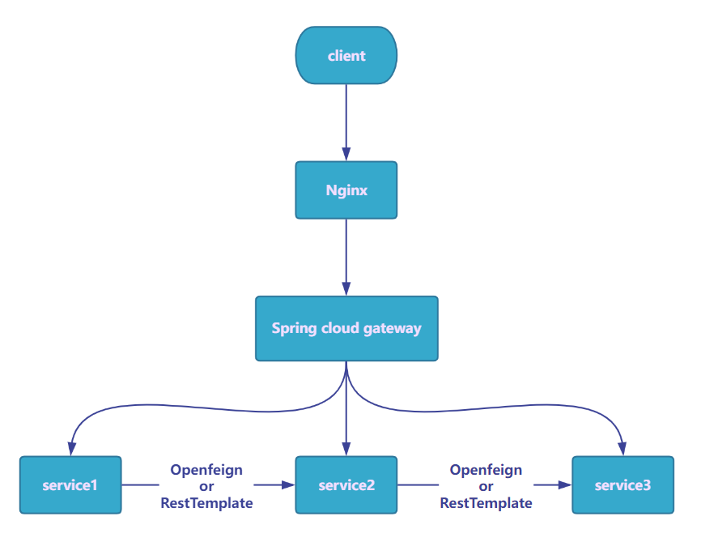
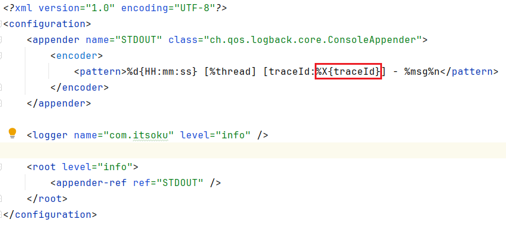

**高并发、微服务 、性能调优实战案例100讲，所有案例均源于个人工作实战，均配合代码落地**

加我微信：itsoku，所有案例均提供在线答疑。


# 第44节 微服务链路日志追踪实战

<span style="font-weight:bold; color:red">目前整个课程59块钱，100个案例，含所有源码 & 文档 & 技术支持，可点击左下角小黄车了解</span>

又是非常实用的一节，掌握后，排错效率将提升好几倍。


## 1、微服务中，接口报错，如何快速定位问题？

需要日志的辅助，一般错误日志中有详细的堆栈信息，具体是哪行代码报错，都可以看到。

要想快速定位问题，前提是要能够快速定位日志。

但是微服务调用链路通常比较复杂，先来看下微服务常见的调用流程，如下图，一个请求可能会调用多个服务。



## 2、解决方案：链路日志追踪

1. 服务端入口处，也就是gateway接收到请求后，可以生成一个唯一的id，记做：traceId，然后传给被调用的服务
2. 整个请求过程中，所有参与者，均需要将traceId向下传递，且日志中需要输出traceId的值

3. 给客户端的返回值中，添加一个通用的字段：traceId，将上面的traceId作为这个字段的值

4. 这样客户端发现接口有问题的时候，直接将这个traceId提供给我们，我们便可以在日志中快速查询出对应的日志

> 系统需要将所有日志收集起来，存到ElasticSearch中，可以就可以通过traceId快速检索了


## 3、代码落地

### 1）gateway改造

所有的请会先到达gateway，这里可以添加一个拦截器，拦截所有的请求，在请求转发前，生成一个traceId，放到请求头中，向下传递即可。

```java
com.itsoku.lesson044.gateway.TraceFilter
```

### 2）下层微服务改造

下层微服务，也就是上图中最下面的部分：service1、service2、service3

添加一个Filter，拦截所有请求，从请求头中读取调用者传递过来的traceId，然后丢到ThreadLocal中和Logback中，这样日志中就会输出traceId

```java
com.itsoku.lesson044.common.trace.TraceFilter
```

MDC是logback为我们提供的一个扩展的入口，可以向里面放入一些键值对，然后在logback中的日志中就可以通过这个traceId获取到对应的值

如下，logback.xml中使用`%X{traceId}`可以获取到MDC中设置的traceId



### 3）OpenFeign改造

拦截 OpenFeign 所有请求，在 OpenFeign 发送请求前，将traceId放到请求头中，传递给被调用者

```java
com.itsoku.lesson044.common.trace.TraceRequestInterceptor
```

### 4）RestTemplate 改造

拦截RestTemplate所有请求，在 RestTemplate 发送请求前，将traceId放到请求头中，传递给被调用者

```java
com.itsoku.lesson044.common.trace.TraceRestTemplateRequestCustomizer
```

### 5）线程池改造

为什么需要改造线程池？

Logback日志中能输出traceId，底层是将traceId放到ThreadLocal中，但是ThreadLocal中的数据，在线程池中是获取不到的，所以需要对线程池进行改造

需要使用我们自定义的线程池，如下

```java
com.itsoku.lesson044.common.thread.CommonThreadPoolExecutor
```

重写了submit和execute方法，可以实现调用者和线程池间ThreadLocal中的数据共享，这个自定义线程池，更详细的介绍可以看 26 节。

这个自定义线程池，如何使用呢？

看个案例，代码如下，可以实现线程池使用者和线程池中的线程间traceId共享。

```java
private ThreadPoolExecutor threadPoolExecutor = new CommonThreadPoolExecutor(new CommonThreadPoolExecutor.ThreadLocalContext() {
    @Override
    public Object getContext() {
        return TraceUtils.getTraceId();
    }

    @Override
    public void setContext(Object traceId) {
        TraceUtils.setTraceId((String) traceId);
    }
}, 5, 5, 10, TimeUnit.SECONDS, new LinkedBlockingQueue<>(100));
```

> 原理比较简单：使用线程池执行任务，最终都会调用execute、submit这两个方法，自定义线程池重写了这2个方法
>
> 调用这两个方法执行任务之前，会先调用ThreadLocalContext的第一个方法getContext从当前线程中拿到traceId，然后线程池内部真正执行任务的时候，又会调用ThreadLocalContext的第二个方法setContext，把第一个方法的返回值作为参数传递进去，这样线程池中执行任务的线程就可以拿到这个traceId了。
>
> 更详细的信息直接看源码，一看就懂。


## 4、测试效果

### 测试代码

```
com.itsoku.lesson044.service1.Service1Controller#test1
```

### 启动3个springboot应用

```java
com.itsoku.lesson044.gateway.Lesson044GatewayApplication
com.itsoku.lesson044.service1.Lesson044Service1Application
com.itsoku.lesson044.service2.Lesson044Service2Application
```

### 浏览器中访问

```
http://localhost:8080/lesson044-service1/service1/test1
```

- 此请求链路：gateway->service1->service2
- 大家注意看geteway以及2个服务中，输出的日志中traceId是不是一样


## 5、源码获取

源码在lesson044这个模块中，需要的小伙伴可以加我微信：itsoku，获取。


# 高并发 & 微服务 & 性能调优实战案例100讲

## 已更新 44 节课

<span style="font-weight:bold; color:red">目前整个课程59块钱，含所有源码 & 文档 & 技术支持，一杯咖啡的价格，还没下手的朋友，赶紧了，马上要涨价了</span>。

```java
1. 分片上传实战
2. 通用并发处理工具类实战
3. 实现一个好用接口性能压测工具类
4. 超卖问题的4种解决方案，也是防止并发修改数据出错的通用方案
5. Semaphore实现接口限流实战
6. 并行查询，优化接口响应速度实战
7. 接口性能优化之大事务优化
8. 通用的Excel动态导出功能实战
9. 手写线程池管理器，管理&监控所有线程池
10. 动态线程池
11. SpringBoot实现动态Job实战
12. 并行查询，性能优化利器，可能有坑
13. 幂等的4种解决方案，吃透幂等性问题
14. 接口通用返回值设计与实现
15. 接口太多，各种dto、vo不计其数，如何命名？
16. 一个业务太复杂了，方法太多，如何传参？
17. 接口报错，如何快速定位日志？
18. 线程数据共享必学的3个工具类：ThreadLocal、InheritableThreadLocal、TransmittableThreadLocal
19. 通过AOP统一打印请求链路日志，排错效率飞升
20. 大批量任务处理常见的方案（模拟余额宝发放收益）
21. 并发环境下，如何验证代码是否正常？
22. MySql和Redis数据一致性
23. SpringBoot数据脱敏优雅设计与实现
24. 一行代码搞定系统操作日志
25. Aop简化MyBatis分页功能
26. ThreadLocal 遇到线程池有大坑 & 通用解决方案
27. SpringBoot读写分离实战（一个注解搞定读写分离 && 强制路由主库）
28. MQ专题-MQ典型的使用场景
29. MQ专题-如何确保消息的可靠性
30. MQ专题-SpringBoot中，手把手教你实现事务消息
31. 手写一个好用的延迟任务处理工具类
32. MQ专题-MQ延迟消息通用方案实战
33. MQ消息幂等消费 & 消费失败衰减式重试通用方案 & 代码 & 文档
34. MQ专题：顺序消息通用方案实战 & 代码落地 & 文档
35. MQ专题：消息积压相关问题及解决思路
36. 分布式事务-MQ最终一致性-实现跨库转账（案例+源码+文档）
37. 分布式事务-MQ最终一致性-实现电商账户余额提现到微信钱包（案例+源码+文档）
38. 分布式事务：通用的TCC分布式事务生产级代码落地实战
39. 分布式锁详解
40. 分享一个特别好用的Redissson分布式锁工具类
41. 一个注解轻松搞定分布式锁
42. 微服务中如何传递公共参数？
43. 接口幂等，通用方案 & 代码落地
44. 微服务链路日志追踪实战
```


## 课程部分大纲，连载中。。。。

以下课程均来源于个人多年的实战，均提供原理讲解 && 源码落地

1. 分片上传实战
2. 通用并发处理工具类实战
3. 实现一个好用接口性能压测工具类
4. 超卖问题的4种解决方案，也是防止并发修改数据出错的通用方案
5. Semaphore实现接口限流实战
6. 并行查询，优化接口响应速度实战
7. 接口性能优化之大事务优化
8. 通用的Excel动态导出功能实战
9. 手写线程池管理器，管理&监控所有线程池
10. 动态线程池
11. SpringBoot实现动态Job实战
12. 并行查询，性能优化利器，可能有坑
13. 幂等的4种解决方案，吃透幂等性问题
14. 接口通用返回值设计与实现
15. 接口太多，各种dto、vo不计其数，如何命名？
16. 一个业务太复杂了，方法太多，如何传参？
17. 接口报错，如何快速定位日志？
18. 线程数据共享必学的3个工具类：ThreadLocal、InheritableThreadLocal、TransmittableThreadLocal
19. 通过AOP统一打印请求链路日志，排错效率飞升
20. 大批量任务处理常见的方案（模拟余额宝发放收益）
21. 并发环境下，如何验证代码是否正常？
22. MySql和Redis数据一致性
23. SpringBoot数据脱敏优雅设计与实现
24. 一行代码搞定系统操作日志
25. Aop简化MyBatis分页功能
26. ThreadLocal 遇到线程池有大坑 & 通用解决方案
27. SpringBoot读写分离实战（一个注解搞定读写分离 && 强制路由主库）
28. MQ专题：MQ典型的7种使用场景
29. MQ专题：如何确保消息的可靠性
30. MQ专题：SpringBoot中，手把手教你实现事务消息
31. 手写一个好用的延迟任务处理工具类
32. MQ专题：延迟消息通用方案实战
33. MQ专题：消息幂等消费 & 消费失败自动重试通用方案 & 代码落地
34. MQ专题：顺序消息通用方案实战
35. MQ专题：消息积压问题
36. 分布式事务-MQ最终一致性-实现跨库转账（案例+源码+文档）
37. 分布式事务-MQ最终一致性-实现电商账户余额提现到微信钱包（案例+源码+文档）
38. 分布式事务：通用的TCC分布式事务生产级代码落地实战
39. 分布式锁
40. 分享一个特别好用的Redissson分布式锁工具类
41. 分布式锁：一个注解轻松实现布式锁
42. 微服务中如何传递上下文？实战
43. 接口幂等，通用方案 & 代码落地
44. 微服务链路日志追踪实战
45. MyBatis进阶：封装MyBatis，实现通用的无SQL版CRUD功能，架构师必备
46. MyBatis进阶：自己实现通用分表功能，架构师必备
47. MyBatis进阶：实现多租户隔离ORM框架
48. SpringBoot中实现自动监听PO的变化，自动生成表结构
49. SpringBoot优雅停机
50. 分布式专题：其他实战课程等
51. 性能调优：如何排查死锁？
52. 性能调优：如何排查内存溢出？
53. 性能调优：CPU被打满，如何排查？
54. 性能调优：生产代码没生效，如何定位？
55. 性能调优：接口太慢，如何定位？
56. 性能调优：如何查看生产上接口的入参和返回值？
57. 性能调优：远程debug
58. 生产上出现了各种故障，如何定位？
59. db和缓存一致性，常见的方案
60. Redis场景案例。。。
61. 系统资金账户设计案例（一些系统涉及到资金操作）
62. 工作中常见的场景案例设计与实现。。。