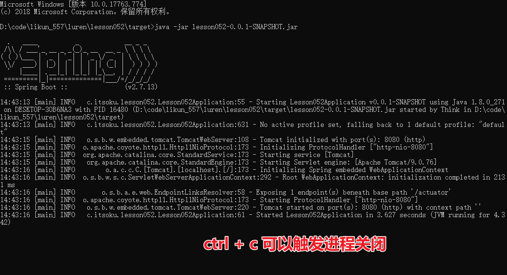
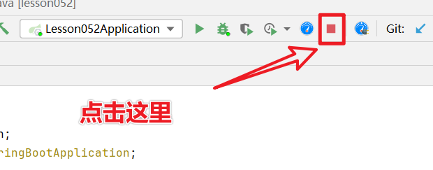

**高并发、微服务 、性能调优实战案例100讲，所有案例均源于个人工作实战，均配合代码落地**

加我微信：itsoku，所有案例均提供在线答疑。


# 第52节 SpringBoot 优雅停机

非常硬核的一节，先收藏点赞，慢慢看。

<span style="font-weight:bold; color:red">目前整个课程59块钱，100个案例，含所有源码 & 文档 & 技术支持，可点击左下角小黄车了解</span>


# 1、SpringBoot优雅停机是什么意思？

Spring优雅停机，通俗点说就是如何优雅的停止SpringBoot应用，

优雅停机，应满足下面3点：

1. SpringBoot应用不再接收新的请求
2. SpringBoot应用将已经进来的请求处理完成
3. 然后关闭SpringBoot应用

> 注意：这里说的停机，并不是停止我们的机器，而是停止我们的SpringBoot应用。


# 2、什么是立即停机？

直接把springboot应用强制关掉，比如linux中的：`kill -9 进程id`，这个命令就会触发强制关闭进程，相当于突然断电一样。

这种可能导致严重的问题

1. 用户体验差，用户请求还在处理中，springboot突然下线，会导致用户收到错误响应
2. 可能会引起系统中数据不一致


# 3、举例：餐馆营业

假如咱们开了一个餐馆，现在不想营业了，有2种方案

## 方案1：优雅关门

1. 门口挂个牌：已打样，这样顾客看到后，就不会进来了
2. 将店内已经在就餐的顾客服务完毕
3. 关门

## 方案2：暴力关门

1. 将餐馆内还在就餐的顾客直接轰出去
2. 关门

大家，感觉那种方案好？


# 4、SpringBoot优雅停机步骤

SpringBoot中已内置了优雅停机的方案，只需做一些简单的配置就可以了，具体步骤如下。

## 1）applicaiton.yml中添加配置

```yaml
server:
  # 停机方式，immediate：立即停机，默认值；graceful：优雅停机
  shutdown: graceful
```

## 2）触发停机常见的方式

### linux中：kill 进程pid

先通过jps命令找到进程id

```shell
jps
```

kill 进程id，触发优雅停机

```shell
kill 进程id
```

> 注意，`kill -9 进程id`是强制结束进程，不会触发优雅停机，相当于直接断电一样。

### 命令窗口中：ctrl+c



## idea中



# 5、效果演示：立即停机


# 6、效果演示：优雅停机


# 7、原理：JVM退出钩子

JVM退出钩子是指在JVM关闭时会被调用的回调方法。

在JVM关闭时，会执行所有的`shutdown hooks`。

可以使用`Runtime.getRuntime().addShutdownHook()`方法来注册一个退出钩子。

以下是一个简单的Java示例，演示了如何注册和使用JVM退出钩子：

```java
public class ShutdownHookDemo {
    public static void main(String[] args) {
        Runtime.getRuntime().addShutdownHook(new Thread() {
            @Override
            public void run() {
                System.out.println("优雅停机测试1....");
            }
        });
        Runtime.getRuntime().addShutdownHook(new Thread() {
            @Override
            public void run() {
                System.out.println("优雅停机测试2....");
            }
        });
    }
}
```

执行输出：

```java
优雅停机测试2....
优雅停机测试1....
```


# 8、SpringBoot优雅退出原理：通过jvm钩子实现的

源码位置：

```java
org.springframework.boot.SpringApplicationShutdownHook#addRuntimeShutdownHook
```

在jvm退出的时候会干一些事情，主要的事情：

1. 让web服务器（如Tomcat、Undertow、Jetty）不在接收新的请求
2. 将已经进来的请求处理完成
3. 销毁spring容器中的bean
4. 退出jvm


# 9、拓展：SpringCloud优雅停机步骤

## 1）将服务从服务注册中心下线

SpringCloud 涉及到服务注册中心，若服务下线前，没有提前告诉注册中心，而直接把服务下线了，而注册中心、以及其他服务消费者以为这个服务还活着，则还会有请求过来，会导致请求报错。

所以下线前需要先从注册中心中将服务摘除，然后需要等到注册中心最新的数据同步到其他服务消费者后，才可以将服务优雅停机。

常用的注册中心有eureka，nacos，他们都有服务下线的相关api，可以先调用这些api让服务从注册中心下线

> 具体的api，大家可以查询相关文档，或者咨询AI

## 2）休眠一段时间：等待注册中心数据同步给其他服务消费者

当我们的服务从注册中心摘除后，其他服务可能并不知道

而其他服务会定期从注册中心中拉取数据，所以需要等待一段时间，等到其他服务从注册中心获取到最新的服务列表后，才能对要停机的服务执行优雅停机。

比如微服务从服务注册中心同步的频率是 5 秒

则建议在这个步骤中，休眠 10 秒以确保所有服务都拉取了注册中心最新的数据。

## 3）对需要下线的服务执行优雅停机

```java
1、通过ps命令查询到进程id
2、执行：kill 进程id，触发优雅停机
```

## 4）轮询进程状态 + 超时强制结束

有些情况，执行了`kill 进程id`进程是无法正常结束的，可以通过linux命令去轮询，看下刚才kill的进程是否已结束。

可以设置一个超时时间，比如轮询60秒之后，进程还是会无法结束，那么可以执行`kill -9 进程id`强制结束进程

这样，SpringCloud中的服务就可以优雅下线了。


# 获取，源码 & 文档 & 技术支持

源码在 lesson052 这个模块中，需要的小伙伴可以加我微信：itsoku，获取。


# 高并发 & 微服务 & 性能调优实战案例100讲

## 已更新 52 节课

<span style="font-weight:bold; color:red">目前整个课程59块钱，含所有源码 & 文档 & 技术支持，一杯咖啡的价格，还没下手的朋友，赶紧了，马上要涨价了</span>。

```java
1. 分片上传实战
2. 通用并发处理工具类实战
3. 实现一个好用接口性能压测工具类
4. 超卖问题的4种解决方案，也是防止并发修改数据出错的通用方案
5. Semaphore实现接口限流实战
6. 并行查询，优化接口响应速度实战
7. 接口性能优化之大事务优化
8. 通用的Excel动态导出功能实战
9. 手写线程池管理器，管理&监控所有线程池
10. 动态线程池
11. SpringBoot实现动态Job实战
12. 并行查询，性能优化利器，可能有坑
13. 幂等的4种解决方案，吃透幂等性问题
14. 接口通用返回值设计与实现
15. 接口太多，各种dto、vo不计其数，如何命名？
16. 一个业务太复杂了，方法太多，如何传参？
17. 接口报错，如何快速定位日志？
18. 线程数据共享必学的3个工具类：ThreadLocal、InheritableThreadLocal、TransmittableThreadLocal
19. 通过AOP统一打印请求链路日志，排错效率飞升
20. 大批量任务处理常见的方案（模拟余额宝发放收益）
21. 并发环境下，如何验证代码是否正常？
22. MySql和Redis数据一致性
23. SpringBoot数据脱敏优雅设计与实现
24. 一行代码搞定系统操作日志
25. Aop简化MyBatis分页功能
26. ThreadLocal 遇到线程池有大坑 & 通用解决方案
27. SpringBoot读写分离实战（一个注解搞定读写分离 && 强制路由主库）
28. MQ专题-MQ典型的使用场景
29. MQ专题-如何确保消息的可靠性
30. MQ专题-SpringBoot中，手把手教你实现事务消息
31. 手写一个好用的延迟任务处理工具类
32. MQ专题-MQ延迟消息通用方案实战
33. MQ消息幂等消费 & 消费失败衰减式重试通用方案 & 代码 & 文档
34. MQ专题：顺序消息通用方案实战 & 代码落地 & 文档
35. MQ专题：消息积压相关问题及解决思路
36. 分布式事务-MQ最终一致性-实现跨库转账（案例+源码+文档）
37. 分布式事务-MQ最终一致性-实现电商账户余额提现到微信钱包（案例+源码+文档）
38. 分布式事务：通用的TCC分布式事务生产级代码落地实战
39. 分布式锁详解
40. 分享一个特别好用的Redissson分布式锁工具类
41. 一个注解轻松搞定分布式锁
42. 微服务中如何传递公共参数？
43. 接口幂等，通用方案 & 代码落地
44. 微服务链路日志追踪实战
45. 接口测试利器HTTP Client，不用Postman也可以
46. 封装MyBatis，实现通用无SQL版CRUD功能ORM框架
47. MyBatisPlus 轻松实现多租户数据隔离
48. 电商系统-资金账户表设计 及 应用实战
49. UML画图神器：PlantUML，画图效率飞升
50. 多线程事务，3秒插入百万数据
51. SpringBoot中自动初始化数据库功能，非常好用
52. SpringBoot优雅停机
```


## 课程部分大纲，连载中。。。。

以下课程均来源于个人多年的实战，均提供原理讲解 && 源码落地

1. 分片上传实战
2. 通用并发处理工具类实战
3. 实现一个好用接口性能压测工具类
4. 超卖问题的4种解决方案，也是防止并发修改数据出错的通用方案
5. Semaphore实现接口限流实战
6. 并行查询，优化接口响应速度实战
7. 接口性能优化之大事务优化
8. 通用的Excel动态导出功能实战
9. 手写线程池管理器，管理&监控所有线程池
10. 动态线程池
11. SpringBoot实现动态Job实战
12. 并行查询，性能优化利器，可能有坑
13. 幂等的4种解决方案，吃透幂等性问题
14. 接口通用返回值设计与实现
15. 接口太多，各种dto、vo不计其数，如何命名？
16. 一个业务太复杂了，方法太多，如何传参？
17. 接口报错，如何快速定位日志？
18. 线程数据共享必学的3个工具类：ThreadLocal、InheritableThreadLocal、TransmittableThreadLocal
19. 通过AOP统一打印请求链路日志，排错效率飞升
20. 大批量任务处理常见的方案（模拟余额宝发放收益）
21. 并发环境下，如何验证代码是否正常？
22. MySql和Redis数据一致性
23. SpringBoot数据脱敏优雅设计与实现
24. 一行代码搞定系统操作日志
25. Aop简化MyBatis分页功能
26. ThreadLocal 遇到线程池有大坑 & 通用解决方案
27. SpringBoot读写分离实战（一个注解搞定读写分离 && 强制路由主库）
28. MQ专题：MQ典型的7种使用场景
29. MQ专题：如何确保消息的可靠性
30. MQ专题：SpringBoot中，手把手教你实现事务消息
31. 手写一个好用的延迟任务处理工具类
32. MQ专题：延迟消息通用方案实战
33. MQ专题：消息幂等消费 & 消费失败自动重试通用方案 & 代码落地
34. MQ专题：顺序消息通用方案实战
35. MQ专题：消息积压问题
36. 分布式事务-MQ最终一致性-实现跨库转账（案例+源码+文档）
37. 分布式事务-MQ最终一致性-实现电商账户余额提现到微信钱包（案例+源码+文档）
38. 分布式事务：通用的TCC分布式事务生产级代码落地实战
39. 分布式锁详解
40. 分享一个特别好用的Redissson分布式锁工具类
41. 分布式锁：一个注解轻松实现布式锁
42. 微服务中如何传递上下文？实战
43. 接口幂等，通用方案 & 代码落地
44. 微服务链路日志追踪实战
45. 接口测试利器HTTP Client，不用Postman也可以
46. 封装MyBatis，实现通用无SQL版CRUD功能
47. MyBatisPlus 轻松实现 多租户数据隔离
48. 电商系统-资金账户表设计 及 应用实战
49. 开发者必须掌握的一款UML画图工具，画图效率飞升
50. 多线程事务，3秒插入百万数据
51. SpringBoot自动初始化数据库功能，太好用了
52. SpringBoot优雅停机
53. 分享一个特别好用的集合工具类，开发效率大幅提升
54. 性能调优：如何排查死锁？
55. 性能调优：如何排查内存溢出？
56. 性能调优：CPU被打满，如何排查？
57. 性能调优：生产代码没生效，如何定位？
58. 性能调优：接口太慢，如何定位？
59. 性能调优：如何查看生产上接口的入参和返回值？
60. 性能调优：远程debug
61. 生产上出现了各种故障，如何定位？
62. db和缓存一致性，常见的方案
63. Redis场景案例。。。
64. 系统资金账户设计案例（一些系统涉及到资金操作）
65. 工作中常见的场景案例设计与实现。。。

